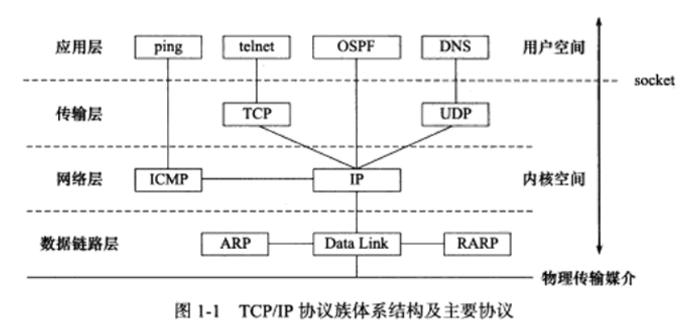
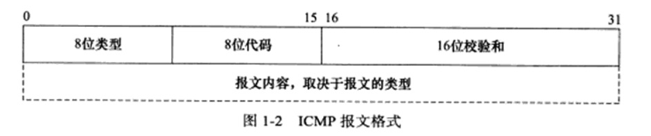

## Linux高性能服务器编程读书笔记

&emsp;&emsp;游双大佬的Linux高性能服务器编程的这本书，是一本入手C++服务器开发的一本经典好书，这种好书会促使我们对其多次阅读，记得我第一次读完这本书时对整个网络编程这块的知识还是处于一种零零散散的状态。读第二遍才渐入佳境。现，我又重读大佬的书，并做一些相应的笔记，也对书中的例子进行实践解读，最后完成制作一个webserver的任务。

### 第一章 TCP/IP协议族

#### 1.1 TCP/IP协议族体系结构以及主要协议

&emsp;&emsp;此书的第一章主要介绍的是TCP/IP协议，包括TCP协议族的体系结构等事项。如下图，TCP/IP协议族是一个四层协议系统，自底向上分别是：数据链路层、网络层、传输层、应用层，上层协议使用下层协议提供的服务。

1.1.1 **数据链路层**

&emsp;<u>实现了网卡接口的网络驱动程序</u>，以数据在物理媒介（以太网、令牌环）上的传输，不同的物理网络有不同的电气特性，网络驱动程序隐藏了这些细节，主要是方便厂商的下层修改，使厂商只需要向上层提供规定的接口即可。

&emsp;&emsp;数据链路层两个常用协议： *ARP协议(Address Resolve Protocol, 地址解析协议)*. 还有*RARP(Reverse Address Resolve Protocol, 逆地址解析协议)*.  这两个协议的作用是：进行IP地址和机器物理地址（通常为MAC地址）之间的相互转换。

##### 1.1.2 **网络层**

&emsp;&emsp;<u>网络层实现了数据包的选路和转发。</u>广域网（WAN）通常使用众多路由器来连接分散的主机或局域网（LAN），也就是说，两台主机一般不是直接相连，而是通过诸多中间节点相连。但网络层对上层协议隐藏了网络拓扑连接的细节，使得传输层和应用程序看来，通信双方是直接相连的。

&emsp;&emsp;网络层重要的协议有*IP协议(Internet Protocol，因特网协议)*以及 *ICMP协议(Internet Control Message Protocol)* 

&emsp;&emsp;其中 IP 协议根据数据包的目的 IP 地址来决定如何投递它。只有数据包到不了目标地址, 就`下一跳`(hop by hop)路由器, 选择最近的，将数据包交给该路由器转发，重复这一过程，数据包最终到达目标主机。

&emsp;&emsp;ICMP 协议是 IP 协议的补充, 主要用来检测网络连接，其报文格式如下：

&emsp;&emsp;ICMP协议分为两大类，分别是：1. 差错报文, 用来回应网络错误 2. 查询报文，查询网络信息(**ping程序就是使用的此报文来判断信息是否送达**)

##### 1.1.3 传输层

&emsp;&emsp;传输层为应用程序封装了一条端到端的逻辑通信链路，它负责数据的收发、链路额超时重连等。它为两台主机的应用提供端到端(end to end)的通信. 与网络层使用的下一跳不同, 它只关心起始端和目的端, 中转过程交给下层处理。（不在乎数据包的中转过程。）
传输层协议主要有三个：TCP协议、UDP协议、SCTP协议，前两者比较重要。

TCP协议(Transmission Control Protocol 传输控制协议)

- 为应用层提供`可靠的, 面向连接, 基于流的服务`
- 通过`超时重传`和`数据确认`等确保数据正常送达.
- TCP需要存储一些必要的状态, 连接的状态, 读写缓冲区, 诸多定时器

UPD协议(User Datagram Protocol 用户数据报协议)

- 为应用层提供`不可靠的, 无连接的, 基于数据报的服务`
- 一般需要自己处理`数据确认`和`超时重传`的问题
- 通信两者不存储状态, 每次发送都需要指定地址信息. `有自己的长度`

SCTP协议(Stream Control Transmission Protocol，流控制传输协议)，为了在因特网上传输电话信号而设计的。

##### 1.1.4 应用层

&emsp;&emsp;应用层负责处理应用程序的逻辑，其主要协议有：

* telnet：一种远程登陆协议
* ping程序：应用程序，非协议
* OSPF（开放最短路径优先）协议：一种动态路由更新协议

#### 1.2 **封装**

- 上层协议发送到下层协议，通过封装实现，层与层之间传输的时候, 加上自己的头部信息。
- 被TCP封装的数据成为 `TCP报文段`，这部分数据中的 TCP 头部信息和 TCP 内核缓冲区（发送缓冲区或接收缓冲区）数据一起构成 TCP 报文段。**内核部分发送成功后删除数据**。

- 被UDP封装的数据成为 `UDP数据报`，**发送后即删除**。

- 再经IP封装后成为`IP数据报`
- 最后经过数据链路层封装后为 `帧`

以太网帧使用 6 字节的目的物理地址和 6 字节的源物理地址表示通信的双端。

以太网最大数据帧1518字节 抛去14头部 帧尾4校验，帧的最大传输单元（MTU），即帧最多能携带多少上层协议数据，

- MTU: 帧的最大传输单元 一般为1500字节
- MSS: TCP数据包最大的数据载量 1460字节 = 1500字节 - 20Ip头-20TCP头 还有额外的40字节可选部分

#### 1.3 分用

&emsp;&emsp;当帧到达目的主机时，将沿着协议栈自底向上依次传递。各层协议依次处理帧中本层负责的头部数据，以获取所需的信息，并将最终处理的帧交给目标应用程序。这个过程就是分用。

&emsp;&emsp;IP、ARP、RARP协议都使用帧传输数据，所以帧的头部需要提供某个字段来区分它们。

&emsp;&emsp;同样，ICMP、TCP、UDP都使用IP协议，所以 IP 数据报的头部采用 16 位的协议（protocol）字段来区分它们。

&emsp;&emsp;TCP、UDP则通过头部的16位端口号来区分上层协议。

#### 1.4 **ARP**

&emsp;&emsp;ARP协议能实现任意网络层地址到任意物理地址的转换。

&emsp;&emsp;ARP 协议工作原理：主机向自己所在的网络广播一个 ARP 请求，该请求包含目标机器的网络地址，此网络上的其他机器都收到了这个请求，但只有被请求的目标主机才会回应一个 ARP 应答，其中包含自己的物理地址。

#### 1.5 DNS

&emsp;&emsp;DNS是一套分布式的域名服务系统，使用DNS协议能够向DNS服务器查询主机的IP地址。
